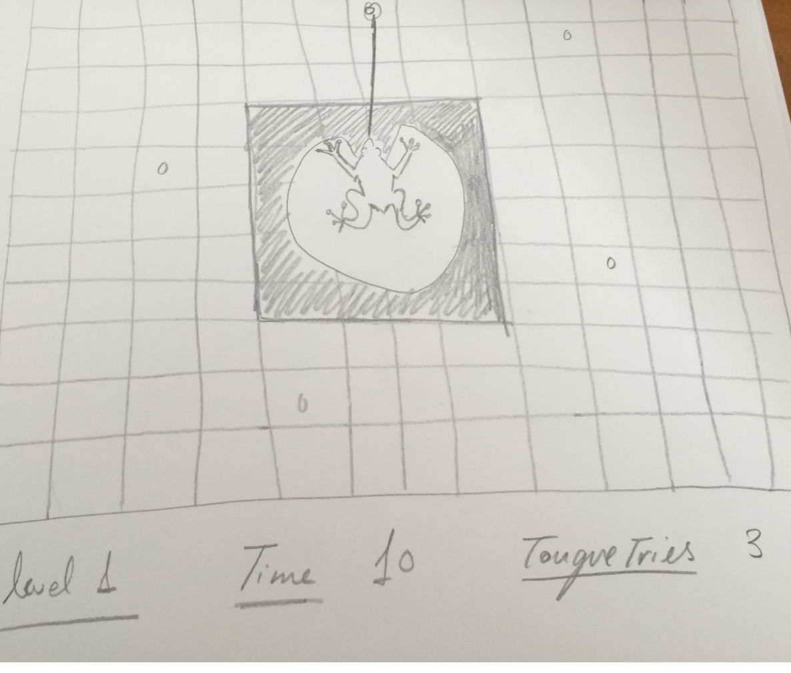

Feed the frog!

Este juego es el proyecto final de la primera parte en mi aprendizaje para llegar a ser desarrollador web

Descripción del juego:

En este juego, nuestro objetivo como rana, es alimentarnos. Para ello debemos intentar atrapar a las moscas con nuestra lengua (desde nuestro nenufar).

Sin embargo las moscas son muy escurridizas, y solo estarán quietas pequeños instantes.

Para superar la pantalla, debemos engullir 10 moscas antes de que se acabe el tiempo!

OJO: tendremos un numero limitado de intentos fallidos, si fallamos demasiado la rana se deprimira :(

